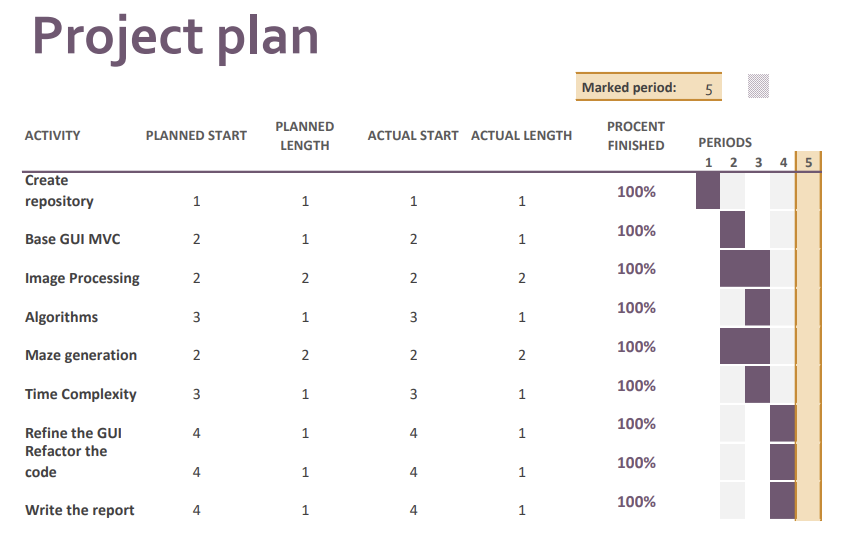

# TODO'S:
 
Features & annat:
- Finslipa time-complexity.
- Städa upp kod + kommentarer.
- MVG-grejer ???

SCALE??? ta bort eftersom det inte fungerar?
  

# Project

## Group Members details
Emma Pesjak, empe2105.
Ebba Nimér, ebni2100.
Link to repo:
https://bitbucket.org/EmmaPesjak/dt183g_project/src/master/

## Environment & Tools
Emma: This assignment was performed on a Windows 10 PC with IntelliJ version 2022.2.3, Java version openjdk 19.0.1,
and Git version 2.33.0.windows.2.

Ebba:
Microsoft Windows 10 Home 64-bit, IntelliJ IDEA 2021.3.3, Command Prompt, openjdk 17.0.2 2022-01-18, 
OpenJDK Runtime Environment (build 17.0.2+8-86), OpenJDK 64-Bit Server VM (build 17.0.2+8-86, mixed mode, sharing),
Apache Maven 3.8.5, and Git version 2.33.0.windows.2

## Purpose
The purpose of this project was to create a maze-solving application in Java. Specifically, create a graphical user
interface (GUI) with swing adhering to the Model-View-Controller (MVC) design pattern. Also, to implement two
different varieties of Dijkstra's algorithm (using different data structures), and the A* algorithm for the pathfinding
in the maze.

## Introduction
Dijkstra's algorithm and the A* search algorithm are commonly used for pathfinding. They are both used for finding the
shortest path in a weighted graph such as a maze, a map etc. The A* algorithm is slightly smarter (in some cases, 
not always in mazes since the shortest path may actually lead away from the finish point) than Dijkstra's algorithm 
since it takes a heuristic value into consideration, going towards the goal. The heuristic value is an estimation 
of the remaining distance from the current point to the goal point, and in this program, not taking the wall obstacles 
of the maze into consideration.

### About the project
When the user starts the application, the main screen is displayed, prompting the user to enter the name of a file
depicting a maze image. A `Select Maze` button lets the user proceed if a proper file name has been entered, otherwise,
a message dialog is shown describing any errors. The user is then prompted to select start and finish coordinates by
clicking on the screen. At any time, the user can go back to the main screen with a `Go back` button. When the start
and finish coordinates have been selected, a `Solve Maze` button appears, which launches the algorithm calculations. If
the user has selected invalid coordinates (e.g. outside the maze, too close to or in a wall), or if no path has been 
found, the user will be prompted to re-pick the start and finish points. If paths have been found, these and their 
calculation times will be displayed on the screen. The user can then restart the program and run a new maze by pressing 
the `Run new maze` button. The program is assumed to run on standard to large screens and has not been adapted to fit 
smaller screens, since this course is focused on algorithms and not design, this should not be an issue for the purpose
of the program.

## Methodology
Emma skriver om MVC/GUI och algoritmerna

Ebba om mazegenerator och pathdrawing

### Project plan
Figure 1 depicts a Gantt chart roughly describing the project plan that has been followed for this project.

 
Figure 1. Gantt chart of the project plan.

## Discussion
by letting the user themselves pick start and finish point the interactivity of the program is increased and it becomes
more flexible as different paths can be found in the same maze...

### Run time complexity
Calculate the run time complexity of all solutions and compare them. Snacka om bigO och 
- Verkar som att 2d boolean array är mest efficient i vårt allt, eftersom alla pixels har samma weights. en graph är
  bättre om man har olika graph strukturer och mer flexibel, men i vårt fall är det mög. dessutom så fick vi ner tiden
  när vi bara genererar maze 1 gång.

### Personal reflections
This project has taught us a lot about different pathfinding algorithms, image processing and GUIs. It has been 
challenging but rewarding.
